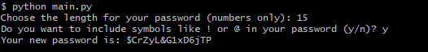

# Python Password Generator

## ✉ About

I created this project with the goal to improve my python skills and also get better at the language syntax.
With this app, you can generate passwords with the desired length and use symbols if you want.

## 🌆 Images



## ⚠ Requirements

In order to run the project, you will need:

Python

## 💻 Technologies Used

## LANGUAGE

- Python

### EDITOR

- Vim (Vi Improved)

## ⬇ How to download the project

```bash

git clone https://github.com/arthur-lage/python-password-generator.git

cd python-password-generator

python ./main.py

```
